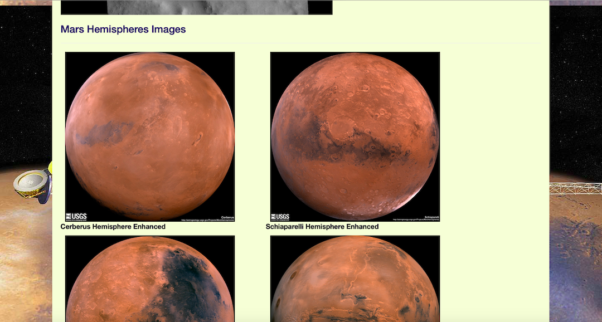
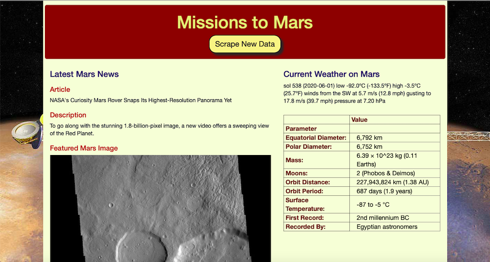

# Missions to Mars

This work presents an app construction that scrapes and presents latest posts about planet Mars. The scraped data includes:

* Latest article posts and their short description from https://mars.nasa.gov/news/
* Featured space image of the planet surface from https://www.jpl.nasa.gov/spaceimages/?search=&category=Mars
* Latest post about weather on Mars from Mars Weather twitter account (https://twitter.com/marswxreport?lang=en)
* Facts about planet Mars from https://space-facts.com/mars/
* High-resolution Mars hemispheres images from https://astrogeology.usgs.gov/search/results?q=hemisphere+enhanced&k1=target&v1=Mars

The app is running about 40 seconds. The app is choosing random article from the latest articles posts from all found (typically 40); random featured space image of the planet surface from all found (typically 32) and random weather post from all found (typically 4). Hit "Scrape New Data" to see different posts.

